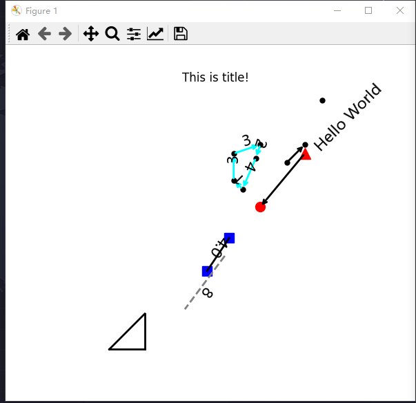

# Nets
Nets is a visualization library for drawing network graphs, based on matplotlib

## 计划开发
- 数据图一键导入生成网络图
- 更多实用方法

# 测试案例

# 注意事项
- Nets的图元布置时，某些图元可以获取在画布上相对与另一图元的真实长度；但同时也可以在场景有限的前提下，随意设置长度，特地提醒