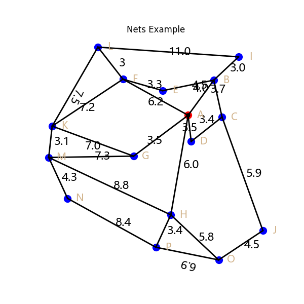

# Nets

Nets is a visualization library for drawing network graphs, based on matplotlib


## 依赖

```
python >= 3.12
matplotlib
```


## 使用

下载：https://github.com/PythonnotJava/Nets/releases/tag/V0.1.0

然后：`pip install Nets-0.1.0-py3-none-any.whl`

## 计划开发

- 样图（长度可能是假的，只是为了呈现图像效果）
- 实际比例图（遵循严格的计算，按比例缩放到图中）

# 注意事项

- Nets的图元布置时，某些图元可以获取在画布上相对与另一图元的真实长度；但同时也可以在场景有限的前提下，随意设置长度，特地提醒
- 图元所有具备的属性，都是真实数据

# 测试案例

```python
from Nets.NetScene import NetScene
from Nets.BaseVar import Offset, NodeVar
from Nets.BaseMixin import TextStyleMixin

netS = NetScene(show_origin=True, titledict=dict(label='Nets Example'), figsize=6, cfg=False)
netS.ax.axis('off')
(A, B, C, D), _, _ = netS.addBindsToAll(
    Offset(0, 0),
    distances_thetas={
        4 : 60,
        3.7 : 280,
        3.4 : 225
    },
    closure=True,
    closureText='3.5',
    bias=0,
    visible=1
)

(A, F, K, G), _, _ = netS.addBindsToAll(
    A,
    distances_thetas={
        6.2 : 145,
        7.2 : 220,
        7 : 335
    },
    closure=True,
    closureText='3.5',
    bias=-.5,
    visible=1
)

(F, E, B, I, L), _, _ = netS.addMixedBindsToALl(
    F,
    mixins=[
        [None, 3.3, 340],
        [B, '4.5', None],
        [None, 3, 50],
        [None, 11, 175]
    ],
    closure=True,
    closureText='3',
    visible=1
)

L, K, _, _ = netS.addTextByConnectNodes(
    L,
    K,
    '7.5',
    bias=-1,
)

(K, M, G), _, _ = netS.addMixedBindsToALl(
    K,
    mixins=[
        [None, 3.1, 265],
        [G, 7.3, None]
    ],
    visible=1
)

(M, N, P, H), _, _ = netS.addMixedBindsToALl(
    M,
    mixins=[
        [None, 4.3, 290],
        [None, 8.4, 325],
        [None, 3.4, 70]
    ],
    closureText='8.8',
    closure=True,
    visible=1
)

(A, H, O, J, C), _, _ = netS.addMixedBindsToALl(
    A,
    mixins=[
        [H, '6', None],
        [None, 5.8, 310],
        [None, 4.5, 40],
        [C, '5.9', None],
    ],
    visible=1
)

O, P, _, _ = netS.addTextByConnectNodes(
    O,
    P,
    '6.9',
    bias=-1,
)

ns : [NodeVar] = [A, B, C, D, E, F, G, H, I, J, K, L, M, N, O, P]

for node in ns[1:]:
    node.setStyle(size=10, color='blue')


netS.addNodeSigns(
    [chr(x) for x in range(65, 65 + len(ns))],
    ns,
    bias=0,
    style=TextStyleMixin(style='normal', size=14, color='tan')
)

netS.save('example')
netS.show()


```


